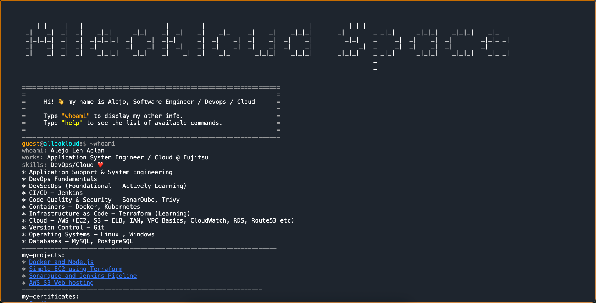

# Terminal Website

Terminal Site
Overview

Terminal Site is an interactive, terminal-style portfolio website that simulates a command-line interface in the browser. It offers a unique and engaging way for visitors to explore your projects, skills, and experiences through custom terminal commands.

Features

Command-line Interface: Provides an immersive terminal-like experience for navigating your portfolio.

Custom Commands: Visitors can type specific commands to view different sections of your site.

Responsive Design: Optimized for both desktop and mobile viewing.

Tech Stack

HTML, CSS, JavaScript: For building the front-end and interactive elements.

Installation

Clone the repository:

git clone https://github.com/alleoko/terminal-site.git
cd terminal-site

Viewing the site:

The website is fully client-side, so you can simply open the index.html file in your web browser to start exploring.

Usage

Open your preferred web browser and load the index.html file.

Interact with the terminal interface by typing commands to navigate through your portfolio.

Contributing

We welcome contributions! Feel free to fork the repository and submit pull requests.

License

This project is licensed under the MIT License.

